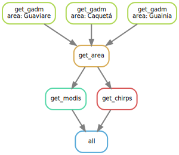

# IDEAS
Sylvain Schmitt -
Jan 24, 2024

- [Installation](#installation)
- [Usage](#usage)
- [Configuration](#configuration)
- [Workflow](#workflow)
- [Data](#data)
- [Development](#development)

My participation into the [IDEAS
project](https://ur-forets-societes.cirad.fr/dans-le-monde/projets-de-recherche/ideas) -
Investigación y Desarrollo para la Estabilización de la frontera
Agropecuaria en Colombia. The aim is to build climate indices related to
land use change in Guaviare.

<div>

[](https://www.repostatus.org/#wip)

</div>



# Installation

This workflow is built on:

- [x] Python ≥3.5
- [x] [Mambaforge](https://github.com/conda-forge/miniforge#mambaforge)

``` bash
conda activate base
mamba create -c conda-forge -c bioconda -n snakemake snakemake
conda activate snakemake
snakemake --help
```

Once installed simply clone the workflow:

``` bash
git clone git@github.com:sylvainschmitt/ideas.git
cd ideas
snakemake -np 
```

# Usage

``` bash
module load bioinfo/Snakemake/7.20.0 # for test on nod depending on your HPC
snakemake -np # dry run
snakemake --dag | dot -Tsvg > dag/dag.svg # dag
snakemake -j 1 --resources mem_mb=10000 # local run (test)
sbatch job_muse.sh # HPC run with slurm
```

# Configuration

Different configuration parameters to set in
[`config/config.yml`](https://github.com/sylvainschmitt/DownClim/blob/dev/config/config_ex.yml)
ordered by steps:

# Workflow

## Step

### [get_chirps](https://github.com/sylvainschmitt/DownClim/blob/main/rules/get_chirps.py)

- Script:
  [`get_chirps.py`](https://github.com/sylvainschmitt/DownClim/blob/main/scripts/get_chirps.py)
- Environment:
  [`xarray.yml`](https://github.com/sylvainschmitt/DownClim/blob/main/envs/xarray.yml)

Description.

# Data

[**CHIRPS 2.0**](https://www.chc.ucsb.edu/data/chirps)**: Rainfall
Estimates from Rain Gauge and Satellite Observations**

*Climate Hazards Group InfraRed Precipitation with Station data (CHIRPS)
is a 35+ year quasi-global rainfall data set. Spanning 50°S-50°N (and
all longitudes) and ranging from 1981 to near-present, CHIRPS
incorporates our in-house climatology, CHPclim, 0.05° resolution
satellite imagery, and in-situ station data to create gridded rainfall
time series for trend analysis and seasonal drought monitoring.*

[**TMF V2.1.1**](https://forobs.jrc.ec.europa.eu/TMF)**: Tracking
long-term (1990-2022) deforestation and degradation in tropical moist
forests**

*The European Commission’s Joint Research Centre developed this new
dataset on forest cover change in tropical moist forests (TMF) using 41
years of Landsat time series. The wall-to-wall maps at 0.09 ha
resolution (30m) depict the TMF extent and the related disturbances
(deforestation and degradation), and post-deforestation recovery (or
forest regrowth) through two complementary thematic layers: a transition
map and an annual change collection over the period 1990-2022. Each
disturbance (deforestation or degradation) is characterized by its
timing and intensity. Deforestation refers to a change in land cover
(from forest to non-forested land) when degradation refers to a
temporary disturbance in a forest remaining forested such as selective
logging, fires and unusual weather events (hurricanes, droughts,
blowdown).*

[**MODIS**](https://modis.gsfc.nasa.gov/)**: Moderate Resolution Imaging
Spectroradiometer**

*MODIS (or Moderate Resolution Imaging Spectroradiometer) is a key
instrument aboard the Terra (originally known as EOS AM-1) and Aqua
(originally known as EOS PM-1) satellites. Terra’s orbit around the
Earth is timed so that it passes from north to south across the equator
in the morning, while Aqua passes south to north over the equator in the
afternoon. Terra MODIS and Aqua MODIS are viewing the entire Earth’s
surface every 1 to 2 days, acquiring data in 36 spectral bands, or
groups of wavelengths (see MODIS Technical Specifications). These data
will improve our understanding of global dynamics and processes
occurring on the land, in the oceans, and in the lower atmosphere. MODIS
is playing a vital role in the development of validated, global,
interactive Earth system models able to predict global change accurately
enough to assist policy makers in making sound decisions concerning the
protection of our environment.*

[**ERA5-Land**](https://cds.climate.copernicus.eu/cdsapp#!/dataset/reanalysis-era5-land?tab=overview)

*ERA5-Land is a reanalysis dataset providing a consistent view of the
evolution of land variables over several decades at an enhanced
resolution compared to ERA5. ERA5-Land has been produced by replaying
the land component of the ECMWF ERA5 climate reanalysis. Reanalysis
combines model data with observations from across the world into a
globally complete and consistent dataset using the laws of physics.
Reanalysis produces data that goes several decades back in time,
providing an accurate description of the climate of the past.*

# Development

First create or update the `dev-ideas` mamba environment with required
libraries:

``` bash
mamba env create -f envs/dev-ideas.yml # init
mamba env update -f envs/dev-ideas.yml --prune # update
mamab activate dev-ideas
```
